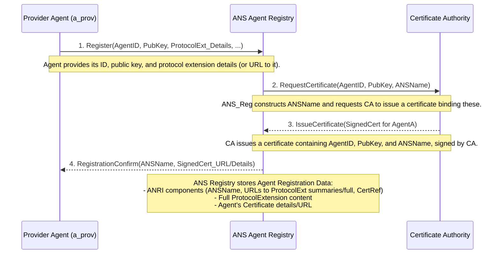
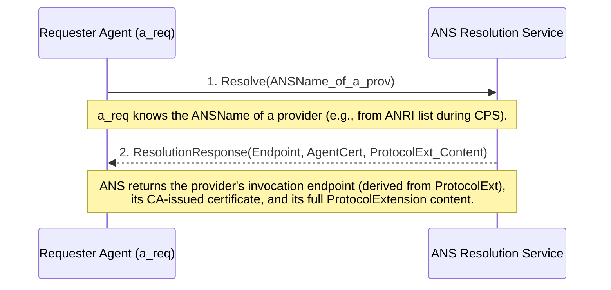
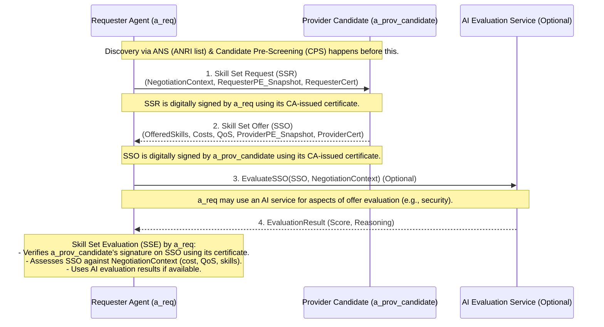
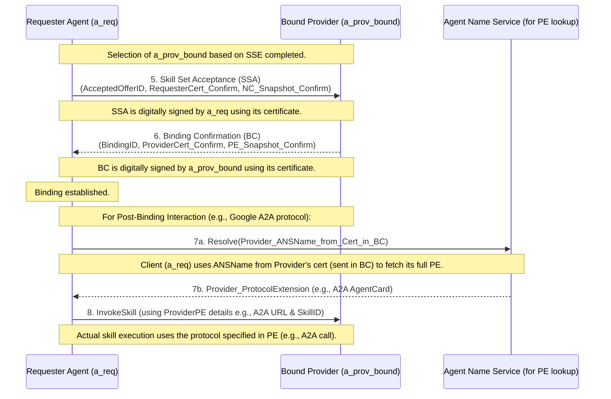

# Agent Capability Negotiation and Binding Protocol (ACNBP) Platform

**Author:** Ken Huang, Vineeth Sai Narajala, Idan Habler, Akram Sheriff

## Project Introduction

This Next.js web application is designed to demonstrate and explore the core concepts of the **Agent Capability Negotiation and Binding Protocol (ACNBP)**. ACNBP facilitates precise and secure interactions in multi-agent systems, typically operating in conjunction with an Agent Name Service (ANS) for initial agent discovery. This platform provides an interactive way to visualize and experiment with key ACNBP phases:

*   **Candidate Pre-Screening (CPS) Support:** The "ANS Agent Registry" and "ANS Resolution" features simulate how a Requester Agent (`a_req`) might discover and get initial details of potential Provider Agents. ACNBP's CPS phase would use such information (e.g., ANRI lists from ANS) for initial filtering.
*   **Skill Set Request (SSR) & Offer (SSO):** The "Capability Negotiation" page demonstrates the core exchange where `a_req` defines its requirements (Negotiation Context) and sends an SSR to selected `a_prov_candidate`(s). Provider agents would then respond with a specific Skill Set Offer (SSO).
*   **Skill Set Evaluation (SSE):** The "Offer Evaluation" page utilizes AI (Genkit & Gemini) to assess SSOs based on criteria like cost, QoS, protocol compatibility, and security requirements, assisting `a_req` in selecting the most suitable offer.
*   **Skill Set Acceptance (SSA) & Binding Confirmation (BC):** The "Secure Binding" page simulates the final agreement stages. `a_req` sends an SSA to accept an offer, and `a_prov_bound` (the chosen provider) responds with a BC. This process involves CA-issued certificates for signing these critical messages.
*   **Post-Binding Interaction (Conceptual):** The "Secure Binding" page also illustrates (in Step 7) how, once an ACNBP binding is established, agents can then use various communication protocols (e.g., Google's A2A, MCP) for actual skill execution. These protocols and their details would have been communicated via `protocolExtension` fields during the ACNBP negotiation.

The platform aims to provide a tangible way to understand the dynamics of ACNBP-brokered agent interactions and the role of supporting services like ANS.

## Key Protocol Flows Illustrated

The following diagrams illustrate the core interactions simulated by this platform.

### Figure 1: ANS Agent Registration and Certificate Issuance

This diagram shows how a Provider Agent (`a_prov`) registers with the ANS Agent Registry and receives a CA-issued certificate, making its metadata (like ANRI components) available.



### Figure 2: ANS Name Resolution

This diagram illustrates how a Requester Agent (`a_req`) can resolve an ANSName to get detailed information about a Provider Agent, which is crucial for ACNBP.



### Figure 3: ACNBP Core Negotiation Flow (SSR, SSO, SSE)

This diagram shows the central negotiation messages of ACNBP between a Requester Agent (`a_req`) and a Provider Agent Candidate (`a_prov_candidate`).



### Figure 4: ACNBP Secure Binding Confirmation (SSA, BC) & Post-Binding Interaction Setup

This diagram shows the final binding messages and the conceptual setup for post-binding communication, such as using Google's A2A protocol.



## Important: Demo Status and Future Improvements

**This project is currently a demonstration and proof-of-concept. It is NOT production-ready.**

Significant work is required to address security, scalability, and robustness before it could be considered for any real-world deployment. Key areas for future improvement include:

### Security Enhancements:
1.  **Secret Management:**
    *   Currently, API keys (like `GOOGLE_API_KEY`) are managed via `.env` files, and cryptographic keys (e.g., for the mock CA) are generated and stored in-memory or hardcoded.
    *   **Improvement:** Integrate a dedicated secret management solution (e.g., HashiCorp Vault, AWS Secrets Manager, Google Secret Manager) for securely storing and accessing all private keys, API keys, and other sensitive credentials.
2.  **Database Security (if RDBMS is used):**
    *   If evolving beyond SQLite to a production RDBMS, implement robust defenses against SQL injection vulnerabilities (e.g., parameterized queries, ORM best practices).
3.  **DDoS Attack Mitigation:**
    *   Implement rate limiting on API endpoints to prevent abuse and mitigate Denial of Service attacks.
    *   Consider using Web Application Firewalls (WAFs) and other infrastructure-level protections.
4.  **Comprehensive PKI Implementation:**
    *   The current CA and certificate issuance are highly simplified. A production system would require a robust PKI with proper certificate lifecycle management (revocation via CRL/OCSP), hardware security modules (HSMs) for CA keys, and adherence to PKI best practices.
5.  **Input Validation and Sanitization:**
    *   Enhance input validation on all API endpoints and user-facing forms to prevent common web vulnerabilities.

### Scalability and Robustness:
1.  **Production-Grade Database:**
    *   Replace the current SQLite implementation (which is file-based and primarily for single-node development) with a production-quality database system. Options include:
        *   **Distributed SQL/NoSQL Databases:** (e.g., PostgreSQL, MySQL with clustering, Cassandra, CockroachDB) for scalability and resilience.
        *   **Blockchain/Distributed Ledger Technology (DLT):** For scenarios requiring high immutability, transparency, and decentralized trust, though this comes with performance and complexity trade-offs.
2.  **Distributed Architecture:**
    *   Design the ANS services (Registry, Resolution) for distributed deployment to handle a large number of agents and requests (e.g., using microservices, load balancing, geographic distribution).
3.  **Caching Strategies:**
    *   Implement caching layers (e.g., Redis, Memcached) for frequently accessed data to improve resolution latency and reduce database load.
4.  **Asynchronous Processing:**
    *   For operations like complex AI evaluations or batch registrations, consider using message queues and background workers to improve responsiveness.
5.  **Monitoring and Logging:**
    *   Integrate comprehensive logging and monitoring to track system health, performance, and security events.

## Key Ideas (Agent Capability Negotiation and Binding Protocol - ACNBP)

The ACNBP platform is built around the following key ideas from the referenced paper:

1.  **Structured Negotiation:** ACNBP defines a formal multi-step protocol (SSR, SSO, SSA, BC) for agents to negotiate capabilities, ensuring clarity and mutual understanding before binding.
2.  **ANS-Leveraged Discovery:** ACNBP assumes Provider Agents are discoverable via an Agent Name Service (ANS). ANS provides initial metadata like ANSNames and pointers to Protocol Extensions, which are crucial for the Candidate Pre-Screening (CPS) phase of ACNBP.
3.  **Protocol Extensions:** Agents exchange detailed, protocol-specific information (e.g., A2A AgentCards for Google's A2A protocol, MCP endpoint details, or other custom protocol data) within their `protocolExtension` fields. This enables interoperability for skill execution after a binding is confirmed.
4.  **Negotiation Context (NC):** The Requester Agent (`a_req`) defines its precise needs—covering desired capabilities, specific skills, Quality of Service (QoS) targets, cost constraints, and security requirements—in a Negotiation Context. This NC is sent in the Skill Set Request (SSR) to guide the negotiation.
5.  **Secure Binding with PKI:** ACNBP mandates the use of digital signatures for its messages (SSR, SSO, SSA, BC). Agents use CA-issued certificates that bind their Agent ID, Public Key, and ANS Endpoint, allowing for verifiable identities and secure communication channels during the binding process.
6.  **AI-Assisted Evaluation:** The protocol supports intelligent evaluation of offers. This platform demonstrates this with an LLM (via Genkit and Gemini) assessing Skill Set Offers (SSOs) against `a_req`'s Negotiation Context, particularly focusing on security aspects.
7.  **Dynamic Updates (Conceptual):** While not fully implemented in this demo, ACNBP includes provisions for Dynamic Capability Updates (DCU) to manage changes in long-lived bindings.

## Prerequisites

Before you begin, ensure you have the following installed:
*   [Node.js](https://nodejs.org/) (version 18.x or later recommended)
*   [npm](https://www.npmjs.com/) (usually comes with Node.js) or [yarn](https://yarnpkg.com/)
*   SQLite3 (Ensure SQLite3 command-line tools are installed if you wish to inspect the `agent_registry.db` file directly. The application uses the `sqlite3` npm package which bundles its own binaries, so this might not be strictly necessary for running the app itself.)

## How to Run

1.  **Clone the repository (if you haven't already):**
    ```bash
    git clone https://github.com/appsec2008/https---github.com-appsec2008-ACNBP-Protocol.git # Replace with your actual repo URL
    cd your-repo-name # Replace with your actual repo directory
    ```

2.  **Install dependencies:**
    ```bash
    npm install
    # or
    yarn install
    ```

3.  **Set up Environment Variables (for AI features):**
    The AI-powered offer evaluation features use Google's Gemini model via Genkit. To enable these, you need a Google AI API Key.
    *   Create a file named `.env` in the root directory of the project.
    *   Add your API key to this file:
        ```
        GOOGLE_API_KEY=YOUR_API_KEY_HERE
        ```
    *   Replace `YOUR_API_KEY_HERE` with your actual API key obtained from [Google AI Studio](https://aistudio.google.com/app/apikey).
    *   **Important:** The `.env` file should be in your `.gitignore` to prevent committing your API key.

4.  **Run the development server:**
    The application uses Next.js for the frontend and Genkit for AI flow management.
    *   **For Next.js (Frontend):**
        ```bash
        npm run dev
        # or
        yarn dev
        ```
        This will typically start the Next.js development server on `http://localhost:9002`.
        The first time you run the app, an `agent_registry.db` SQLite file will be created in the project root (or `/tmp/` in production-like Vercel builds). This database is used by the ANS simulation parts of the platform.

    *   **For Genkit (AI Flows - if you want to inspect/develop flows locally):**
        In a separate terminal, you can run the Genkit development server:
        ```bash
        npm run genkit:dev
        # or use with watch mode
        npm run genkit:watch
        ```
        This starts the Genkit development UI, usually on `http://localhost:4000`, where you can inspect and test your AI flows. The Next.js application calls these flows directly as server actions, so running the Genkit server separately is primarily for development and debugging of the flows themselves.

5.  **Open your browser:**
    Navigate to `http://localhost:9002` (or the port specified in your terminal) to see the application.

## How to Contribute

Contributions are welcome! If you'd like to contribute to this project, please follow these general guidelines:

1.  **Fork the Repository:** Create your own fork of the project on GitHub.
2.  **Create a Branch:** For new features or bug fixes, create a new branch in your fork:
    ```bash
    git checkout -b feature/your-feature-name
    # or
    git checkout -b fix/your-bug-fix
    ```
3.  **Make Changes:** Implement your changes, adhering to the project's coding style and guidelines (e.g., Next.js, React, TypeScript, ShadCN UI, Tailwind CSS, Genkit).
4.  **Test Your Changes:** Ensure your changes don't break existing functionality and that new features work as expected.
5.  **Commit Your Changes:** Write clear and concise commit messages.
    ```bash
    git commit -m "feat: Add new ACNBP message handling"
    ```
6.  **Push to Your Fork:**
    ```bash
    git push origin feature/your-feature-name
    ```
7.  **Open a Pull Request:** Submit a pull request from your fork's branch to the main repository's `main` branch. Provide a clear description of the changes you've made.

Please ensure your code is well-formatted and, if adding new features, consider if any documentation updates are needed.

## Referencing this Project

If you use this ACNBP Platform in your research or work, please consider citing the associated paper:

Huang, Ken, Vineeth Sai Narajala, Idan Habler, Akram Sheriff (2024). *Agent Name Service (ANS): A Universal Directory for Secure AI Agent Discovery and Interoperability*. arXiv preprint arXiv:2505.10609. Retrieved from https://arxiv.org/abs/2505.10609
*(Note: ACNBP builds upon the concepts introduced in the ANS paper. A dedicated ACNBP paper may follow.)*

You can also refer to this software implementation:

Huang, Ken, Vineeth Sai Narajala, Idan Habler, Akram Sheriff. *Agent Capability Negotiation and Binding Protocol (ACNBP) Platform* [Software]. Retrieved from [URL_OF_THIS_GITHUB_REPOSITORY_IF_PUBLIC]

## License

This project is licensed under the MIT License.

```
MIT License

Copyright (c) 2024 Ken Huang,  Vineeth Sai Narajala, Idan Habler, Akram Sheriff

Permission is hereby granted, free of charge, to any person obtaining a copy
of this software and associated documentation files (the "Software"), to deal
in the Software without restriction, including without limitation the rights
to use, copy, modify, merge, publish, distribute, sublicense, and/or sell
copies of the Software, and to permit persons to whom the Software is
furnished to do so, subject to the following conditions:

The above copyright notice and this permission notice shall be included in all
copies or substantial portions of the Software.

THE SOFTWARE IS PROVIDED "AS IS", WITHOUT WARRANTY OF ANY KIND, EXPRESS OR
IMPLIED, INCLUDING BUT NOT LIMITED TO THE WARRANTIES OF MERCHANTABILITY,
FITNESS FOR A PARTICULAR PURPOSE AND NONINFRINGEMENT. IN NO EVENT SHALL THE
AUTHORS OR COPYRIGHT HOLDERS BE LIABLE FOR ANY CLAIM, DAMAGES OR OTHER
LIABILITY, WHETHER IN AN ACTION OF CONTRACT, TORT OR OTHERWISE, ARISING FROM,
OUT OF OR IN CONNECTION WITH THE SOFTWARE OR THE USE OR OTHER DEALINGS IN THE
SOFTWARE.
```
